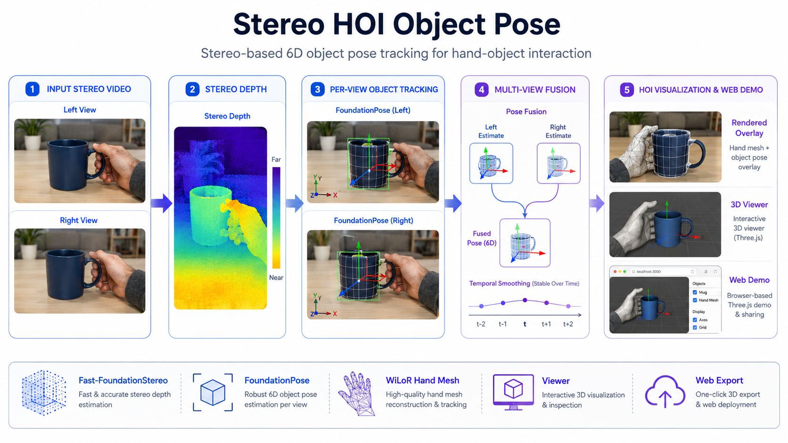

# Stereo HOI — 双目手物交互物体位姿估计

基于双目视频 + 已重建 mesh，估计准确、连续、稳定的物体 6D pose 序列。



> Research status: the current implementation is retained as a legacy
> baseline. The project is being restructured around stereo/multi-view
> observation-level state estimation, reliability, recovery, and public
> benchmark evaluation.

Research planning documents:

- [Research direction and RQs](docs/research_direction.md)
- [Evaluation and benchmark strategy](docs/evaluation_strategy.md)
- [Related work map](docs/related_work.md)
- [Project rearchitecture](docs/rearchitecture.md)

**核心思路**：将 AGILE 的 setting 从单目扩展到双目 — 用 Fast-FoundationStereo 获取更可靠的双目深度，用 FoundationPose 在左右视角上独立 tracking，再融合两个视角的结果。

## 安装

```bash
pip install -e ".[core]"          # 纯融合（无需 GPU）
pip install -e ".[depth]"         # + FFS 深度推理
pip install -e ".[tracking]"      # + FoundationPose tracking（需 Docker）
pip install -e ".[hand,vis]"      # + WiLoR 手部推理 & 可视化
pip install -e ".[all]"           # 全部
```

## 快速开始

```bash
# 查看所有子命令
stereo-hoi --help

# 双目深度估计
stereo-hoi depth clip03 --end_frame 10

# FoundationPose 左视角 tracking（需 Docker 容器内运行）
stereo-hoi track clip03 --camera left --debug 2

# FoundationPose 右视角 tracking
stereo-hoi track clip03 --camera right --debug 2

# 多视角融合（纯 numpy，无需 GPU）
stereo-hoi fuse clip03 --method average --smooth 7

# WiLoR 手部 mesh 推理
stereo-hoi hand clip03 --debug

# 手+物合并渲染
stereo-hoi render clip03 --fps 30

# 交互式 3D 浏览
stereo-hoi viewer clip03

# 导出网页 Demo
stereo-hoi export clip03 --step 3 --rgb
```

## Pipeline

```
双目视频
  ├── 物体位姿 ─────────────────────────────────────────
  │   stereo-hoi depth <clip>          → ffs/depth/
  │   stereo-hoi track <clip> left     → foundationpose_v2/run/
  │   stereo-hoi track <clip> right    → foundationpose_v2/run_right/
  │   stereo-hoi fuse  <clip>          → foundationpose_v2/fused/
  │
  ├── 手部 mesh ────────────────────────────────────────
  │   stereo-hoi hand  <clip>          → wilor/left/*.npz
  │
  ├── 可视化 & 浏览 ────────────────────────────────────
  │   stereo-hoi video  <clip>         → track.mp4 + 对比视频
  │   stereo-hoi render <clip>         → hoi/video_frames/
  │   stereo-hoi viewer <clip>         → Viser 交互式 3D
  │
  └── 网页 Demo ───────────────────────────────────────
      stereo-hoi export <clip> --rgb   → web_demo/ 静态 Three.js
```

## 环境

| 环境 | 用途 |
|------|------|
| `conda activate ffs` | Fast-FoundationStereo 深度推理 |
| `conda activate diffusion` | WiLoR 手部 mesh 推理 + HOI 可视化 |
| FoundationPose Docker 容器 | FoundationPose tracking + 可视化 |

> 纯融合（`stereo-hoi fuse`）不需要 Docker，任意有 numpy 的 Python 环境均可。

## 配置

通过环境变量覆盖默认路径：

| 变量 | 默认值 | 说明 |
|------|--------|------|
| `STEREO_HOI_ROOT` | `pyproject.toml` 所在目录 | 项目根目录 |
| `STEREO_HOI_DATA` | `<root>/data` | 数据根目录 |
| `STEREO_HOI_FFS_DIR` | `<root>/../Fast-FoundationStereo` | FFS 代码路径 |
| `STEREO_HOI_FP_DIR` | `<root>/../FoundationPose` | FoundationPose 代码路径 |
| `STEREO_HOI_WILOR_DIR` | `<root>/../WiLoR` | WiLoR 代码路径 |

## 数据准备

每个 clip 目录需包含：

```
data/<clip>/
├── rgb/                    # 左视角帧  00000.jpg ...
├── right/                  # 右视角帧  00000.jpg ...
├── calib.json              # 双目标定 (K_left, K_right, baseline_m)
├── mask/object/            # 物体 mask  00000.png ...
├── mesh/clean_mesh.obj     # 带纹理物体 mesh
└── ffs/cam_K.txt           # 左相机内参 (3行 3x3)
```

帧编号 5 位 0-padding（`00000.jpg` ...），所有模态共享同一编号。

## 坐标系与单位

- 深度图：**uint16 PNG，单位毫米**（÷1000 = 米）
- 位姿 `ob_in_cam`：**4×4 齐次矩阵**，平移单位**米**
- 相机坐标系：OpenCV/ZED 约定（+X 右、+Y 下、+Z 前）
- 双目已 rectified，`K_left == K_right`，畸变全 0
- `calib.json::baseline_m` ≈ 6.3 cm，右相机在左相机 +X 方向

## 融合策略

| `--method` | 说明 |
|---|---|
| `average` | 等权平均（quaternion mean + translation mean） |
| `left_main` | 默认用 left，仅当左右一致时平均 |
| `left_only` | 仅用左视角（消融基线） |
| `right_only` | 仅用右视角（sanity check） |

| `--outlier_*` | 默认 | 说明 |
|---|---|---|
| `--outlier_trans` | 0.05 (5cm) | 左右平移差超过此值 → 剔除 |
| `--outlier_rot` | 30 (deg) | 左右旋转差超过此值 → 剔除 |
| `--no_outlier` | - | 关闭 outlier 剔除 |

| `--smooth` | 说明 |
|---|---|
| `--smooth 7` | 时域平滑窗口（奇数；默认 gaussian 核） |

## 技术说明

### 右视角深度

右视角深度由左视角 FFS 深度通过 stereo baseline forward warp 得到，不单独跑 FFS：

```
u_right = u_left - fx * baseline / Z
```

空洞由 nearest-neighbor inpainting 填充。

### WiLoR 坐标系对齐

WiLoR 在虚拟相机坐标系中输出 MANO hand mesh。采用**手腕锚定**对齐到真实 metric 相机坐标系：

```
verts_metric = verts_mano - joints[0] + wrist_3d
```

MANO 顶点保持真实米尺度。FFS 深度用于确定手腕的 metric 3D 位置。

### 渲染坐标系

所有 3D 渲染中，手部和物体均在**左相机坐标系**（OpenCV）。3D viewer 和 web demo 中将坐标转换为 Viser/Three.js 约定（+X 右、+Y 上、+Z 后，即 `to_viser(X,Y,Z) = (X, -Y, -Z)`）。

## 包结构

```
src/stereo_hoi/
├── _pathresolver.py     # 路径解析
├── hoi_data.py          # 共享数据加载 & 坐标转换
├── cli.py               # 统一 CLI
├── depth/
│   ├── engine.py        # FFS 批量推理
│   └── warp.py          # 左→右深度/遮罩 warping
├── tracking/
│   ├── engine.py        # FoundationPose tracking
│   └── data_reader.py   # 数据读取器（含右视角 warp）
├── fusion/
│   ├── core.py          # Rotation 类 + 融合策略
│   ├── outlier.py       # outlier 检测
│   └── smooth.py        # 时域平滑
├── hand/
│   ├── engine.py        # WiLoR 推理
│   └── alignment.py     # 度量对齐 + 渲染 + 手部过滤
└── vis/
    ├── hoi_render.py    # 手+物 2D 叠加渲染
    ├── viewer.py        # Viser 3D 交互浏览器
    ├── export_web.py    # 静态网页资产导出
    └── compare_video.py # 对比视频生成
```

## 参考

- [Fast-FoundationStereo](https://github.com/NVlabs/FoundationStereo)
- [FoundationPose](https://github.com/NVlabs/FoundationPose)
- [WiLoR](https://github.com/rolpotamias/WiLoR) — End-to-end 3D hand localization and reconstruction (CVPR 2025)
- [MANO](https://mano.is.tue.mpg.de) — Hand model
